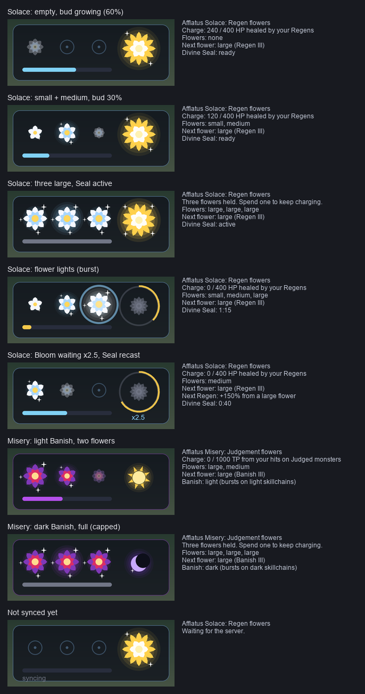

# White Mage flower gauge (AscensionXI)

**Status, 2026-10-10:** prototype, seen in game. The dlac half is complete and tested
headless (`tests/ascensionxi_whmgauge.lua`), and the owner saw it on the local shard on
10-10. The server half is on AXI draft PR #873 (branch `claude/whm-flower-gauge`,
`modules/custom/lua/whm_flowers.lua`). It has 44 xi_test cases, three mutation sweeps, and
the three job abilities that spend flowers: Bloom, Harvest and Nightshade. It is not in the
game until AXI merges and deploys it. The design record and the owner's open questions are
in the AXI repo: `documentation/custom/whm-flower-gauge.md`.

## What it is

*Offline render of `draw.panel`'s actual draw-list calls at scale 1.5: recorded in Lua,
painted with PIL. The in-game anti-aliasing differs slightly.*

AscensionXI gives White Mage one resource per Afflatus stance. FFXIV's Lily Gauge is the
visual reference. dlac draws it **passively**: no tab and no Job helper row. The gauge
appears by itself while the main job is WHM and a stance is up, and hides otherwise.

- **Afflatus Solace.** Your Regens charge the gauge with the HP they really heal, bonuses
  included, so a bloomed or sealed Regen fills it faster (owner, 10-10 evening). A flower
  costs one unbonused Regen's whole healing: 125, 240 or 400 HP for Regen I, II or III. The big golden bloom on the right is Divine Seal: lit while ready, a
  clock sweep while recasting, bright and turning while it's up.
- **Afflatus Misery.** Melee rounds that land on a Judged monster (Banish marks it) charge
  the gauge with one hit's base TP; a flower is 500 (1000 until the owner's 10-10 ruling,
  "it was very slow"). The threshold rides every STATE, so dlac needed no change. A magic
  burst with Banish is damage only and charges nothing (owner, 10-10 evening). The glyph on
  the right is Banish's element: a sun, or a moon once the
  Banish has been turned dark.
- **Flower size.** Three slots, as in FFXIV. A flower's size is its tier:
  - Regen/Banish I: a small glimmer (5 petals)
  - II: medium (6 petals, two rings)
  - III: large (8 petals, a halo)

  The next empty slot shows a bud that grows with the charge and bursts into light when the
  flower is made.

## Files

| File | Role |
|---|---|
| `servers/ascensionxi/modules/whmgauge/init.lua` | Ashita glue: shared 0x1E0 gate, the partition tap (0xD0-0xDF blocked before decoding), zone and unload edges, the window, `/dl gauge`, `<char>\dlac\whmgauge.lua` settings |
| `.../whmgauge/wire.lua` | Pure codec. The contract is the AXI repo's `job_gauge_wire.lua`; a shared 16-byte vector is pinned in both suites |
| `.../whmgauge/gauge.lua` | Pure client state: when to subscribe, the stance trust rule, what to draw (`view()`) |
| `.../whmgauge/draw.lua` | The art. Draw-list shapes only (no textures): petals are convex polygons filled by `PathFillConvex`, with a triangle-fan fallback |
| `.../whmgauge/demo.lua` | `/dl gauge demo`: a 48 s loop through every state, no server needed |
| `servers/ascensionxi/modules.lua` | Mount list (`whmgauge` added) |
| `servers/ascensionxi/transport.lua` | `producerOf` names the 0xD0-0xDF partition `whm gauge` |
| `tests/ascensionxi_whmgauge.lua` | Headless suite |

## Packet budget (the AutoAcc lesson)

The client asks for nothing it can see itself:

- its job and level
- the Afflatus buffs (417 Solace, 418 Misery)
- Divine Seal (78) and Divine Seal's recast, through `feature\recast`

The server sends only what it alone knows: the flowers, the charge, the tier, the Banish
element and a waiting Bloom. In detail:

- **One request per zone,** only while the main job is White Mage. `SUBSCRIBE` (0xD0) goes
  out 3 s after zone-in. The server keeps the subscription in a local variable, so a zone-out
  ends it and nothing has to stop it.
- **Pushes only on a change that's drawn.**
  - Flower, stance and flag changes go within 250 ms (coalesced).
  - A charge change goes only when it moves the bar by a twentieth, and at most once a second.
  - A Regen III run in the server suite produces at most one push a second (WF-53).
  - A frame is about 24 bytes.
- **Unknown or old servers cost almost nothing.**
  - `BAD_OP` or `UNAVAILABLE`: silent for the session.
  - `BUSY` (more than one subscribe a second): retry after 2 s.
  - Silence: back off 5, 15 and 60 s, then silent for the session.
- **Hiding the gauge** (`/dl gauge hide`) also stops the requests.
- **Unload** sends a stop straight to the packet manager, as combat telemetry does.

## The stance trust rule

The server's flowers are drawn only when the server's stance matches the buff the client
sees. Switching stance therefore draws an empty gauge at once, never the old flowers. This
matches the server rule: switching to the other stance withers everything, while merely
losing the stance (zoning, death, Dispel) keeps the flowers.

## Commands

`/dl gauge` toggles it (`show`, `hide`). It also takes:

- `lock` / `unlock`
- `scale N` (0.6-3)
- `demo`
- `status` (channel state in chat)

The position is remembered once a drag settles.

## Field checks

Round 1 (10-10 morning): the gauge never drew, because `init.lua` read a global `imgui`.
Fixed in 2026.10.10b. Round 2: "looks good", but the x2.5 label clipped in the game font.
Fixed in 2026.10.10c by measuring with `CalcTextSize`. Regen "doing nothing" was full HP:
only real healing counts (owner ruling).

Still owed, with the AXI branch running on the local shard:

1. The gauge fills from Regen ticks on a hurt target and lights a flower.
2. The Divine Seal bloom and its recast sweep.
3. A switch to Misery empties it.
4. Banish Judgement plus melee fills the Misery gauge, now twice as fast.
5. Bloom, Harvest and Nightshade change it within a quarter second: a flower spent, the x
   label, the sun turning to a moon.
6. The art reads well at scale 1 and 1.5.
7. Scroll Lock hides it with the game HUD.

Stub-imgui tests can't catch width or printf problems. A screenshot is the test for those.
